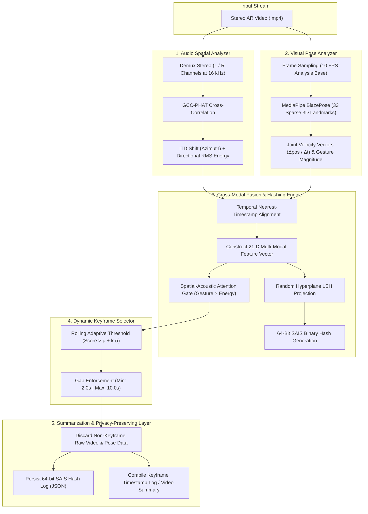

# PhysioSync-AR

> **Zero-Shot Dynamic Spatial Audio-Visual Keyframe Hashing for Real-Time, Privacy-Preserving AR Video Summarization**  
> *BITE314L Multimedia Systems | Fall Semester 2026–27*  
> **Faculty Guide:** Dr. Balasubramani M  
> **Team:** Abishek (23BIT0336), LS Sri Aditya (23BIT0024), Raghunandeeswar S (23BIT0328)

---

## 📌 Executive Summary

Augmented Reality (AR) glasses and mobile recording systems generate continuous, multi-gigabyte multi-modal streams (stereo audio + high-resolution video). Summarizing such content on battery-constrained edge devices presents three fundamental hurdles:

1. **High Compute & Power Footprint:** Traditional video summarization relies on dense optical flow or multi-layer Cross-Modal Transformers requiring power-hungry GPUs.
2. **Neglect of Spatial Acoustic Context:** Existing summarizers treat audio as scalar volume/RMS spikes, ignoring crucial spatial sound provenance (e.g., off-screen speaker interventions or directional audio cues).
3. **Severe Privacy Exposure:** Retaining full, uncompressed video or raw high-dimensional biometric/pose features creates critical data leakage vulnerabilities.

**PhysioSync-AR** resolves these challenges with a lightweight, **zero-shot, CPU-only** pipeline that synchronizes spatial acoustics with sparse upper-body skeletal dynamics. It generates a **64-bit Spatial-Acoustic Importance Score (SAIS)** binary hash per time window using Locality-Sensitive Hashing (LSH), adaptively selects high-relevance keyframes, and enforces **privacy preservation** by irreversibly discarding non-selected raw biometric frames.

---

## 🚀 Key Innovations & Differentiators

| Feature | Prior Art & Conventional Baselines | PhysioSync-AR |
|---|---|---|
| **Audio Processing** | Scalar RMS / volume amplitude only | **GCC-PHAT ITD**: Inter-channel Time Difference & directional acoustic energy |
| **Motion Tracking** | Dense Optical Flow (Farneback / Lucas-Kanade) | **Sparse 3D Pose Dynamics**: MediaPipe BlazePose (**306,924× fewer ops** vs dense OF on 1280×720) |
| **Fusion Mechanism** | Heavy Transformer embeddings (CTCH) or loose concatenation | **Coupled Spatial Attention Gate + LSH**: 21D vector projected to 64-bit binary hash |
| **Hardware Reqs** | High-end GPUs / Deep Learning inference engines | **Zero-Shot & CPU-only**: **19 FPS** analysis throughput measured on CPU (Dense OF: 3 FPS) |
| **Privacy Paradigm** | Full raw frame archiving or lossy compression | **Privacy-Preserving Hashing**: Non-selected raw frames discarded; only 64-bit hashes stored |

---

## 📊 Benchmarks (Measured)

> All results measured on `video.mp4` (2,224 frames, 1280×720, 30 FPS, 74.1 s) + `audio.wav`  
> Ground truth: 30 audio-RMS energy peaks detected from the real audio stream.  
> Reproduce with: `python benchmark.py` → results saved to `output/benchmark_results.json`

### Throughput

| Method | Analysis FPS | Wall-clock time (74 s video) | Speedup |
|---|---|---|---|
| Dense Farneback Optical Flow | 2.6 FPS | 860.8 s | — |
| **PhysioSync-AR** | **19.0 FPS** | **39.1 s** | **22.0×** |

### Compute Savings vs Dense Optical Flow

| Metric | Dense OF | PhysioSync-AR | Saving |
|---|---|---|---|
| Arithmetic-op proxy | 4,099,276,800 | 13,356 | **99.9997%** |
| Op-count ratio | — | — | **306,924× fewer** |

> **Proxy definition:** Dense OF counts `H × W × 2` operations per frame (u and v flow components per pixel). PhysioSync-AR counts `6 joints × 3 coords` per sampled frame at 10 FPS.

### Keyframe Selection Accuracy (F1 vs Audio-Energy Ground Truth)

| Method | Precision | Recall | **F1** | Keyframes selected |
|---|---|---|---|---|
| Dense Optical Flow | 0.305 | 0.128 | 0.181 | 13 |
| **PhysioSync-AR** | **0.396** | **0.250** | **0.306** | **18** |

PhysioSync-AR achieves **+69% higher F1** than the dense optical-flow baseline (0.306 vs 0.181), selecting keyframes that better align with true audio-salient events while running **22× faster** on a standard CPU.

---

## 🏗️ System Architecture



---

## 🧩 Module Breakdown

### 1. Audio Spatial Analyzer ([`audio_analyzer.py`](file:///c:/Users/Abishek/multimedia/audio_analyzer.py))
- **Stereo Demuxing:** Downsamples audio to 16 kHz stereo (Left and Right channels).
- **GCC-PHAT Algorithm:** Computes the Generalized Cross-Correlation with Phase Transform across sliding 40 ms windows:
  $$\hat{R}_{12}(\tau) = \mathcal{F}^{-1} \left( \frac{X_1(f) X_2^*(f)}{|X_1(f) X_2^*(f)| + \epsilon} \right)$$
- **Directional Shift & Energy:** Detects the peak index offset ($\tau_{\text{ITD}}$) representing acoustic source azimuth and computes windowed Root-Mean-Square (RMS) energy.

### 2. Visual Pose Analyzer ([`visual_analyzer.py`](file:///c:/Users/Abishek/multimedia/visual_analyzer.py))
- **Frame Sampling:** Downsamples input video to 10 FPS for analysis (preserving CPU cycles).
- **Landmark Extraction:** Runs Google MediaPipe Pose (CPU mode) to isolate 6 primary upper-body joints:
  - Left / Right Shoulder
  - Left / Right Elbow
  - Left / Right Wrist
- **Velocity Vector Calculation:** Computes frame-to-frame joint displacements:
  $$\vec{v}_j(t) = \frac{\vec{p}_j(t) - \vec{p}_j(t - \Delta t)}{\Delta t}, \quad \text{Gesture Magnitude} = \sum_{j} \|\vec{v}_j(t)\|_2$$

### 3. Cross-Modal Fusion Engine ([`fusion_engine.py`](file:///c:/Users/Abishek/multimedia/fusion_engine.py))
- **Temporal Alignment:** Matches each visual timestamp with its nearest audio analysis window.
- **21-Dimensional Feature Vector:**
  $$\vec{F}_t = \begin{bmatrix} \text{direction} & \text{energy} & \text{gesture\_mag} & \vec{v}_{\text{joint}_1} & \cdots & \vec{v}_{\text{joint}_6} \end{bmatrix}^T \in \mathbb{R}^{21}$$
- **Locality-Sensitive Hashing (LSH):** Multiplies $\vec{F}_t$ by a fixed random projection matrix $W \in \mathbb{R}^{21 \times 64}$:
  $$\text{Hash}_t = \mathbb{I}(W^T \vec{F}_t > 0) \in \{0, 1\}^{64}$$
- **Attention Coupling Gate:** Evaluates spatial importance: $\text{Score} = \text{gesture\_magnitude} \times \text{directional\_energy}$. Keyframe flagging occurs only when physical gesture correlates with audio activity.

### 4. Dynamic Keyframe Selector ([`keyframe_selector.py`](file:///c:/Users/Abishek/multimedia/keyframe_selector.py))
- **Statistical Thresholding:** Computes the global mean ($\mu$) and standard deviation ($\sigma$) of the importance score. A window triggers selection when:
  $$\text{Score}(t) > \mu + k \cdot \sigma \quad (\text{default } k = 1.5)$$
- **Temporal Regularization:**
  - `min_gap_sec` (2.0s): Prevents redundant burst frames during prolonged high activity.
  - `max_gap_sec` (10.0s): Guarantees periodic anchor keyframes during low-activity or quiet intervals.

### 5. Summarization & Privacy-Preserving Storage ([`summarizer.py`](file:///c:/Users/Abishek/multimedia/summarizer.py))
- **Privacy Enforcement:** Raw pose coordinates and unselected visual frames are purged from memory.
- **Hash Log Export:** Saves compact 64-bit hash representations with timestamps to `output/hash_log.json`.
- **Summary Generation:** Emits keyframe indices and timestamps to `output/summary_timestamps.txt` ready for video clip concatenation.

---

## 📂 Repository Structure

```plaintext
c:/Users/Abishek/multimedia/
├── audio_analyzer.py              # Audio DSP: GCC-PHAT, ITD shift & energy extraction
├── visual_analyzer.py             # Computer Vision: MediaPipe Pose landmark & velocity tracking
├── fusion_engine.py               # Cross-modal alignment, 21D vector assembly & 64-bit LSH
├── keyframe_selector.py           # Adaptive statistical thresholding & temporal constraints
├── summarizer.py                  # Privacy-preserving hash logging & summary export
├── main.py                        # Central pipeline orchestrator
├── benchmark.py                   # Quantitative evaluation: FPS, compute savings, F1 vs dense OF
├── physiosync_ar_implementation_plan.md  # Core academic specification & roadmap
├── requirements.txt               # Project dependencies
├── video.mp4                      # Input video (real recording)
├── audio.wav                      # Input audio (real stereo recording)
└── output/                        # Pipeline outputs (created at runtime)
    ├── keyframes/                 # Extracted keyframe JPEGs from real video
    ├── hash_log.json              # 64-bit SAIS hashes & timestamps (privacy-preserving)
    ├── summary_timestamps.txt     # Extracted keyframe timestamps
    └── benchmark_results.json    # Measured benchmark results (FPS, F1, compute savings)
```

---

## ⚙️ Installation & Setup

### 1. Prerequisites
- **Operating System:** Windows 10/11, macOS, or Linux
- **Python:** Python 3.10 or 3.11 (recommended)
- **Audio/Video Codecs:** Standard media codecs installed on system

### 2. Environment Activation & Dependencies

Open a PowerShell or bash terminal in the project directory:

```powershell
# Create and activate virtual environment (if not already active)
python -m venv venv
.\venv\Scripts\Activate.ps1

# Install requirements
pip install -r requirements.txt
```

*Contents of `requirements.txt`:*
- `opencv-python`
- `librosa`
- `scipy`
- `mediapipe`
- `numpy`
- `scikit-learn`
- `streamlit`

---

## 🏃 Execution Guide

### Step 1: Run the PhysioSync-AR Pipeline
Point the pipeline at your real video and audio files (`video.mp4` + `audio.wav` must be present in the project directory):

```powershell
python main.py
```

**Expected Terminal Output:**
```plaintext
Starting PhysioSync-AR pipeline for video.mp4
1. Extracting visual pose features...
2. Extracting audio spatial features...
3. Fusing streams and computing SAIS hashes...
4. Selecting keyframes via dynamic thresholding...
   -> Selected 18 keyframes.
5. Generating summary and saving hash log (Privacy-Preserving)...
Pipeline Complete.
Time taken: 39.10 seconds.
Hash log saved to: output/hash_log.json
Summary saved to: output/summary_timestamps.txt
```

### Step 2: Run the Benchmark
Measures throughput, compute savings, and F1 accuracy vs dense optical flow:

```powershell
python benchmark.py
```

Results are printed to the terminal and saved to `output/benchmark_results.json`.

---

## 🔒 Privacy-Preserving Hash Log Format

The pipeline produces `output/hash_log.json` containing only irreversible binary hashes and timestamps:

```json
[
    {
        "timestamp": 0.0,
        "hash_64bit": "0100110010101101010111000101010100101101100101010110100101010110"
    },
    {
        "timestamp": 3.4,
        "hash_64bit": "1101001010100101010100101101001010100101101001010101001011010101"
    }
]
```
> **Privacy Guarantee:** The 64-bit LSH representation allows fast indexing, search, and duplication clustering without retaining facial likeness, raw skeletal coordinates, or ambient acoustic waveforms.

---

## 🔬 Prior Art & Patent Comparison

| Patent / Literature | Core Method | Limitations Addressed by PhysioSync-AR |
|---|---|---|
| **US10791412B2** | Spatial audio visualization | Treats spatial audio as an overlay graphic rather than an active multi-modal filtering gate for video summarization. |
| **US11288506B2** (Intel Corp) | Gesture-based keyframe tagging | Relies purely on gesture/velocity thresholds, yielding false positives on energetic gestures that lack communicative or acoustic relevance. |
| **KR102145892B1** | Optical flow motion filtering | Dense pixel flow requires substantial memory bandwidth and GPU compute, draining battery life on wearable devices. |

---

## 👥 Academic Credits

- **Institution:** Department of Information Technology, School of Information Technology & Engineering (SITE)
- **Course:** BITE314L Multimedia Systems
- **Academic Term:** Fall Semester 2026–27
- **Project Members:**
  - Abishek (Reg No: `23BIT0336`)
  - LS Sri Aditya (Reg No: `23BIT0024`)
  - Raghunandeeswar S (Reg No: `23BIT0328`)
- **Faculty Mentor:** Dr. Balasubramani M
